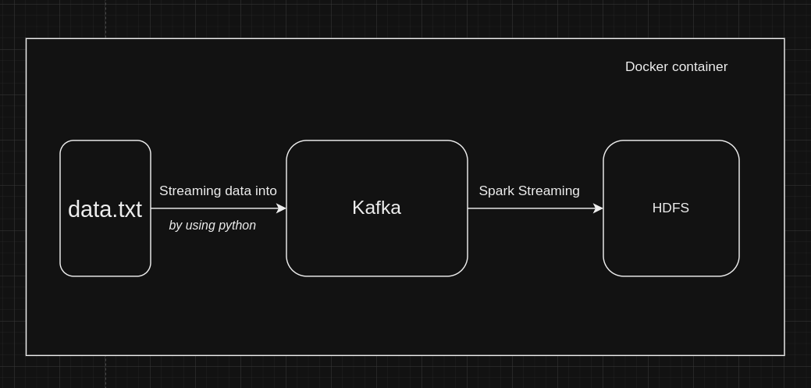
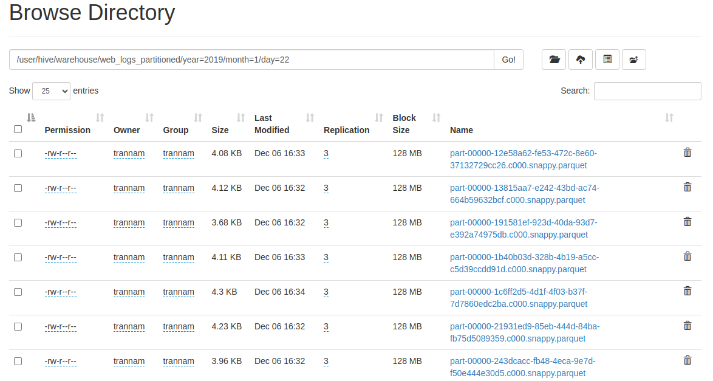

# **Data Pipeline using Kafka, Spark, Hadoop on Docker**

An end-to-end data pipeline that leverages Apache Kafka for real-time data streaming, Apache Spark for processing, and Hadoop for scalable storage, all deployed seamlessly with Docker.
## Table of Contents
- [Introduction](#introduction)
- [Features](#features)
- [Architechture](#architecture)
- [Project Structure](#project-structure)
- [Prerequisites](#prerequisites)
- [Setup and Deployment](#setup-and-deployment)
- [How it runs](#how-it-runs)
- [Exception](#exception)
- [Contributing](#contributing)
## **Introduction**
This project demonstrates a scalable data pipeline using Dockerized versions of:
- **Apache Kafka**: For real-time data streaming.
- **Apache Spark**: For batch and streaming data processing.
- **Hadoop HDFS**: For scalable and distributed data storage.

---

## **Features**
- Real-time data ingestion with Kafka.
- Stream processing with Spark.
- Scalable data storage using HDFS.
- Containerized environment with Docker for easy deployment.
- Modular design for seamless integration and scaling.
- Able to Coding with Jupyter notebook 
---

## **Architecture**
The pipeline includes the following components:

1. **Data Source**: A producer application that generates and streams data to Kafka topics.
2. **Kafka**: Acts as a message broker to handle real-time data.
3. **Spark**: Processes the data from Kafka streams and prepares it for storage.
4. **HDFS**: Stores the processed data for long-term use.

**Diagram**:
 

---
## **Project Structure**
```
project 
├── docker-compose.yml
├── hadoop_config
│   ├── core-site.xml
│   └── hdfs-site.xml
├── hadoop_datanode1
├── hadoop_datenode2
├── hadoop_namenode
├── init-datanode.sh
├── kafka
├── makeStreamIntoKafka
│   ├── app.py
│   ├── data.txt
│   └── Dockerfile
├── notebooks
│   ├── Dockerfile
│   ├── kafkaStream.ipynb
│   ├── readHDFS.ipynb
│   └── writeHDFS.ipynb
├── spark
│   ├── app.py
│   ├── Dockerfile
│   └── jar_files
└── start-hdfs.sh

```
## **Prerequisites**
Before you begin, ensure you have the following installed:
- **Docker** 
- **Docker Compose** 

---

## **Setup and Deployment**

### **1. Clone the repository**
```bash
git clone https://github.com/trann-namm/data-pipeline-kafka-spark-hadoop.git
cd data-pipeline-kafka-spark-hadoop
```

### **2. Start the services**
Use Docker Compose to start all the required services:
```bash
docker compose up --build
```

### **3. Verify the services**
- Jupiter notebook: Access the Kafka broker at `localhost:8888/?token=...`.
- Spark: Access the Spark UI at `http://localhost:8080`.
- HDFS: Access the Namenode UI at `http://localhost:9870`.

---

## **How it runs**

### **1. Produce data to Kafka**
The file **.makeStreamIntoKafka/data.txt** will be read and write into Kafka topic named "mytopic" 5 lines each 5s

### **2. Process data with Spark**
The command:
```bash
spark-submit .spark/app.py
```
will be execute, Spark read streaming data from kafka topic, process it and  write into HDFS as parquet format.
### **3. Check processed data**
Processed data is stored in HDFS. Access the Namenode UI and verify the files.  


### **4. Exception**
If you faced the error HDFS path is in safe mode, you can run the command:
```bash
docker exec -it namenode hdfs dfsadmin -safemode leave
```

## **Contributing**
We welcome contributions! To contribute:
1. Fork the repository.
2. Create a new branch:
   ```bash
   git checkout -b feature/your-feature-name
   ```
3. Commit your changes:
   ```bash
   git commit -m "Add feature: your-feature-name"
   ```
4. Push the changes:
   ```bash
   git push origin feature/your-feature-name
   ```
5. Open a pull request.

---

## **License**
This project is licensed under the [MIT License](LICENSE).

---

## **Contact**
If you have any questions, feel free to reach out:
- Email: namsherlock44@outlook.com
- GitHub: [@your-username](https://github.com/trann-namm)

---

